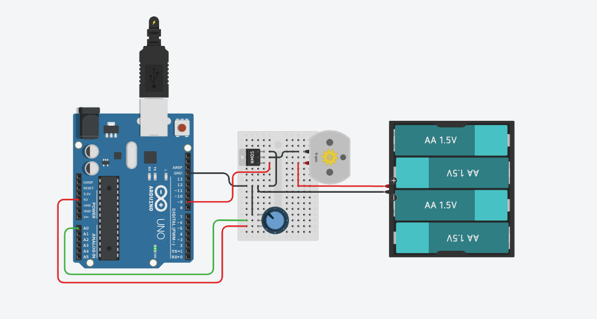

 DC Motor Speed Control using Arduino and Potentiometer

##  Objective

Control the speed of a DC motor using a potentiometer connected to an Arduino. The analog input from the potentiometer is converted into a PWM signal to adjust motor speed.

---

##  Components Required

- 1x Arduino Uno
- 1x Breadboard
- 1x DC Motor
- 1x Potentiometer (10kΩ)
- 1x NPN Transistor (TIP120 or 2N2222)
- 1x Flyback Diode (e.g., 1N4007)
- 1x 3xAA Battery Pack (4.5V)
- Jumper Wires

---

## Circuit Diagram

---

## Working Principle

1. The potentiometer acts as an analog input to the Arduino (`A0` pin).
2. Arduino reads this analog signal (0–1023) and maps it to a PWM range (0–255).
3. The Arduino outputs the PWM signal from digital pin `9` to the base of the NPN transistor.
4. The transistor switches the motor on and off rapidly, controlling the average voltage and thus the motor speed.
5. The flyback diode protects the circuit from voltage spikes due to motor's inductive load.
6. The external 4.5V battery pack powers the motor, keeping the Arduino safe from high current draw.

---

## ⚠️ Safety Tips

- Ensure the ground of the Arduino and the external power source are connected.
- Use a suitable diode (e.g., 1N4007) to prevent back EMF.
- Ensure transistor rating supports your motor's current.

